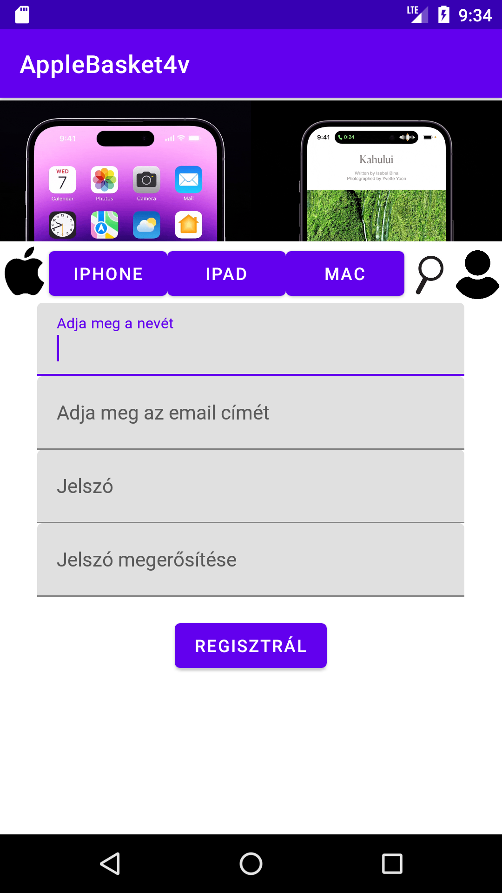
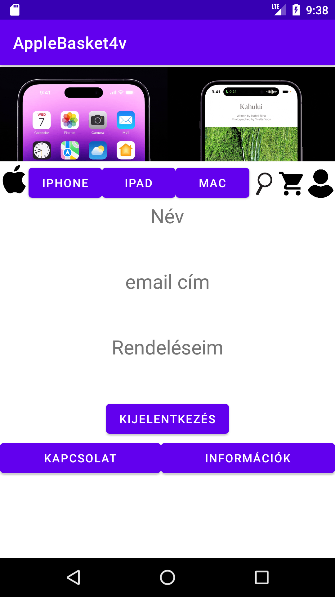

# AppleBasket4v

Telepítési útmutató:

A programot szükséges buildelni, majd az elkészült .apk kiterjesztésű telepítőfájlt egy android operációs rendszerrel ellátott (minim sdk 21, ajánlott 33, java 8 jdk) okostelefonra, majd azt futtatva felinstallálni a programot a telefonra, végül az alkalmazásikonok közül az alkalmazás ikonjára kattintjva elindul a program.

A program indításakor a főképernyő fogad.

A főoldalon lehet választani a termékkategóriák között.
Felül menüsáv fogad, ami minden aloldalon megtalálható, ill. a látblécben ugyancsak minden oldalon látható a kapcsolat és az információk gomb.
Pl. a tablet képre vagy ipad feliratú gombra kattintva kilistázódik az adatbázisból a meghívott API végponton keresztül az Ipadok listája, melyeken láthatóak a tulajdonságai, szín, háttértár, ár és a készlet, ill. egy kis bélyegkép. Itt lehetséges két művelet, a kosárba helyezés, vagy az onnan való törlése a terméknek.
Ez egy scrollozható lista, ujjal lehet végigtekerni a termékek között.

Amennyiben a kapcsolat gombra kattintunk bárhol, akkor megjelenik a kapcsolat aloldal, melyből három alábbi opció választható, melyek elnavigálnak a webes oldal megfelelő linkjére.

Ugyanez igaz az információk aloldalra.

Amennyiben az alma logóra kattintunk a fejléc bal első ikonjára, újra a főoldalra navigálhatunk vissza.
Amennyiben a nagyító ikonra kattintunk, úgy megjelenik a termékkereső.

Amennyiben a kosár ikonra kattintunk a fejlécben, úgy megejelenik az éppen aktuálisan kosárba helyezett termékek listája, amennyiben nincsen még ilyen termék a kosárban, a jelenleg még nincsen termék a kosárban szöveg jelenik meg.

Ha még nem vagyunk belépve, akkor a fejléc jobb oldalán található felhasználó ikonra kattintva bejön a bejelentkező képernyő, ahol az email és a jelszó megadásával bejelentkezést kezdeményezhetünk.

Amennyiben itt nem töltjük ki egyik mezőt sem, akkor a "bejelentkezés vagy regisztráció" gombra kattintva előjön a regisztrációs képernyő, ahol az alábbi adatok megadásával kezdeményezhetjük új felhasználó regisztrációját.

Amennyiben már be vagyunk jelentkezve, akkor a felhasználó ikonjára kattintva az adott bejelentkezett felhasználó adatlapja jelenik meg, név, email cím ill. rendeléseim gomb, továbbá alul a kijelentkezés gomb jelenik meg, melynek megnyomásával az aktuális felhasználó kijelentkezését lehet kezdeményezni, mellyel a főképernyőre jutunk ismét.

